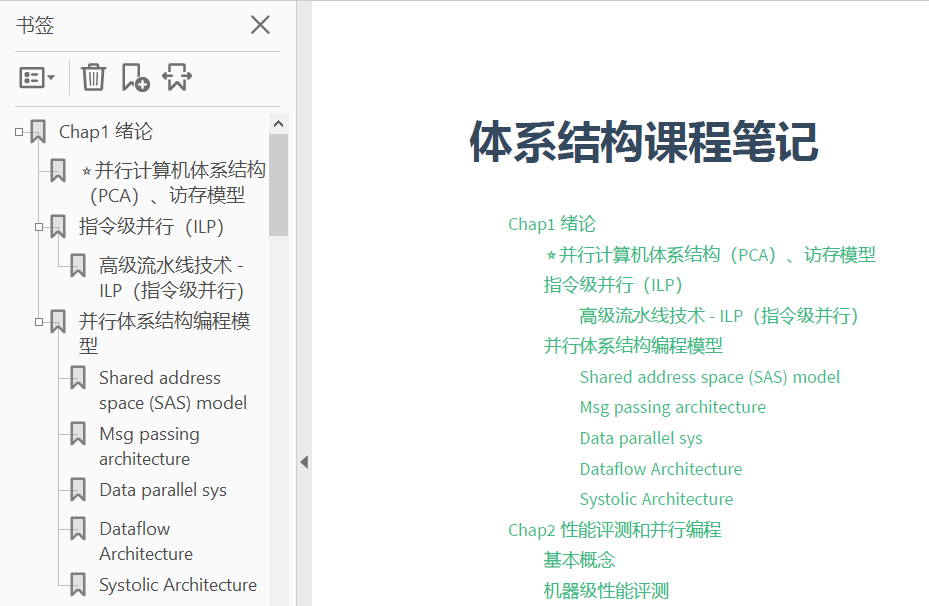
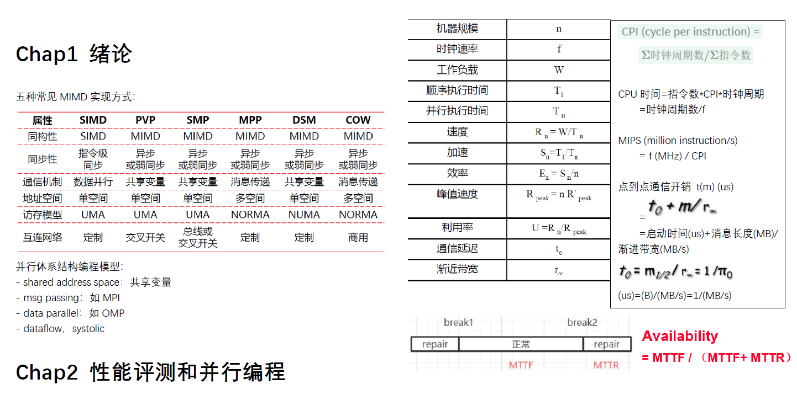

# Distributed System Architecture

课程：高级计算机体系结构2020，吴俊敏老师，中科大研究生课程

这里记录了这门课的一些资料：

1. 我的课程笔记：

Cache coherence上课记的笔记有问题，参考如下材料：

（1）[什么是cache一致性](https://zhuanlan.zhihu.com/p/417487200)

（2）[单机Snoop方案](https://zhuanlan.zhihu.com/p/417949142)

（2.1）[write thru/write back、MESI协议详谈](https://www.xiaolincoding.com/os/1_hardware/cpu_mesi.html#cpu-cache-的数据写入)

（3）[分布式Directory方案](https://zhuanlan.zhihu.com/p/419722803)

2. 作业

3. 应对期末开卷，我精简的笔记：

   

4. 07，08年两年的试卷及部分答案

   > 非常重要，今年虽然没有名词解释，但简答题、分析题和这两份试卷非常像，毕竟出来出去还是那些题。

   今年的4个分析题（50分）：

   - 给一个序列，计算MESI，Dragon两个cache coherence协议操作的时钟周期并分析。
   - Sequential memory consistency下，给出两个线程不合法的输出并解释。
   - 用LL-SC实现ticket lock。
   - 给了6x6 2D mesh中的源节点和多个目的节点，画出双路径多播算法、多路径多播算法的发送路径。

   
